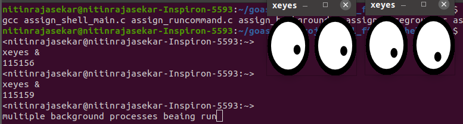

A user-defined interactive shell program that can create and manage new processes. 
Several typical commands have been built from the bottom-up using system calls. The shell is also able to create a process out of the system program itself, such as vim.

System calls act as interfaces offered by the operating system to enable user-level processes to seek services from the kernel. These interfaces serve as a connection between user-level applications and the kernel, facilitating the execution of privileged operations and engagement with hardware resources. The significance of system calls lies in their essential role in overseeing processes, memory, files, and other resources within an operating system.

In the specific context of constructing a shell in Linux, system calls play a crucial role in carrying out diverse tasks, including process creation, execution, and termination, as well as manipulation of files and input/output operations.

--------------------------------------------------------------------------

### Display

On running the code, a shell prompt appears.
The user name and system are not hard-coded, and are derived via system calls.

The directory from which the shell is invoked is the home directory of the shell and is indicated by "~". If the user executes "cd" i.e changes the directory, then the corresponding change is reflected in the shell as well.

--------------------------------------------------------------------------

### Builtin commands

The cd command is implemented, making use of the chdir() system call, among others.

Note that the execvp system call is not used to directly run the implemented commands.

Similarly, the echo and pwd commands are implemented as well.

<i>The shell accounts for random spaces and tabs.</i>

--------------------------------------------------------------------------

### ls

The ls command is also implemented from scratch along with two of its flags, -l and -a.

- The -l flag provides a detailed listing of the flag with further information such as ownership, size, group etc.
-  The -a flag ensures that hidden files and directories are included in the listing.

The flags may be given in any order and may also be combined, such as -al or -la.

--------------------------------------------------------------------------

### Foreground and Background processes

The shell so implemented also has support for foreground and background processes.

A foreground process takes control of the terminal, and we have to wait for it to complete before executing another command.
However, a background command does not block the terminal, and we can continue to enter other commands before it completes.
A ampersand & is appended to a command to get it to run in the background .

The shell can handle multiple background processes simultaneously.

--------------------------------------------------------------------------

### pinfo

The pinfo command is not found in the standard linux shell.

This prints the the process-related info of the shell program.

pinfo<pid> does so for a given process.

--------------------------------------------------------------------------

### Finished Background processes

Again, another feature implemented here which is not present inn the standard shell is the display of the process id when a background process exits, .

<i>Repeat </i> is another custom command that is implemented, which executes a given instruction multiple times.

--------------------------------------------------------------------------

### Input/Output Redirection

Using the symbols '<', '>' and '>>', the output of commands, usually written to stdout, ​can be redirected to another file, or the input taken from a file other than ​stdin​.

Furthermore, 
 - An error message is displayed if the input file does not exist.
 - An output file is created (with permissions ​0644​) if it does not already exist
 - In case the output file already exists,it should be overwritten in case of >​ and appended to in case of ​>>

--------------------------------------------------------------------------

### Command Pipelines

A pipe, identified by | , redirects the output of the command on the left as input to the command on the right. The shell supports multiple pipes.

--------------------------------------------------------------------------

 ### User-defined commands

The 'jobs' command prints a list of currently executing background process, along with their job number (a sequential number assigned by the shell, their name, and their PID.

The 'sig' command takes the job number of a running job, and sends the signal corresponding to the signal number (given as input) to it. If a process with that job number does not exist, it prints an error.

The 'fg' command brings the running or stopped background job corresponding to the ​job number​ to the foreground, and changes its state to ​running.

--------------------------------------------------------------------------

### Signal Handling

<i>Ctrl+C</i>
It interrupts any currently running foreground job, by sending it the <i>SIGINT</i> signal. This has no effect if there are no foreground processes running.

<i>Ctrl+D</i>

This logs the user out of the shell, without having any effect on the actual terminal.

--------------------------------------------------------------------------

assign_runcommand.c contains the runcommand() function which is the primary function to resolve commands after they are parsed, includes echo, cd, pwd, ls and directs to the procedures for foreground and background processes.

assign_foreground.c, assign_background.c are responsible for foreground and background processes respectively, and commands not found in runcommand.

assign_utilities.c contains some utility functions related to parsing commands and ls.

assign_shell_main.c contains the main() function and assign_shell.h contains the headers and function prototypes.

